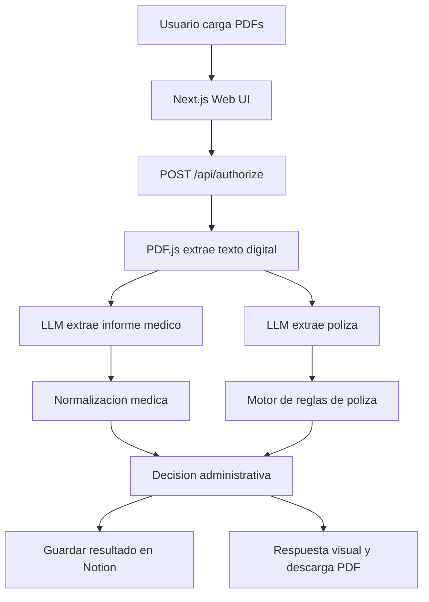

# Agente de Pre-Autorizacion Quirurgica

Sistema web para automatizar la pre-autorizacion de cirugias a partir de dos
documentos PDF: un informe medico y una poliza de seguro. El agente extrae datos
clinicos y contractuales, valida reglas de cobertura y emite una decision
administrativa en tiempo real.

> Aprobaciones medicas en segundos, no en dias.

## Problema

El proceso tradicional de pre-autorizacion quirurgica suele depender de
revision manual de informes medicos, polizas, coberturas, exclusiones y periodos
de carencia. Esto genera demoras, errores operativos y poca trazabilidad para
pacientes, hospitales y aseguradoras.

## Solucion

El sistema centraliza el flujo en una interfaz web:

1. El usuario carga un informe medico y una poliza en PDF.
2. El backend extrae texto digital con PDF.js, compatible con despliegue en Vercel.
3. El LLM estructura los datos clinicos y contractuales.
4. Un motor de reglas valida vigencia, carencia, cobertura, exclusiones y documentos faltantes.
5. La app guarda evidencia en Notion y devuelve una decision: `Aprobado`, `Revision` o `Rechazado`.

## Funcionalidades

- Carga de dos PDFs: informe medico hospitalario y poliza de seguro.
- Extraccion de texto PDF con `pdfjs-dist`, sin depender de `pdf-parse`.
- Compatibilidad con Vercel usando Node.js `22.x`, worker de PDF.js y polyfills para entorno serverless.
- LLM principal configurable, actualmente preparado para Groq con fallback opcional a Gemini.
- Prompts compactos para respetar limites de tokens por minuto.
- Normalizacion medica a CIE-10, CPT y CUPS con tolerancia a codigos no disponibles.
- Validacion deterministica de poliza: vigencia, carencia, cobertura, exclusiones, topes y requisitos documentales.
- Persistencia en Notion para informes, polizas y resultados.
- Descarga de PDF de preaprobacion o PDF de documentos faltantes.
- Pantalla de casos de prueba con fixtures locales.

## Stack Tecnico

| Capa | Tecnologia |
| --- | --- |
| Frontend | Next.js App Router, React, TypeScript, Tailwind CSS |
| Backend | Next.js Route Handlers en runtime Node.js |
| PDF | `pdfjs-dist`, `@napi-rs/canvas`, `pdf-lib` |
| IA | Groq como proveedor principal, fallback opcional |
| Persistencia | Notion API |
| Validacion | Zod, reglas TypeScript |
| Deploy | Vercel |

## Arquitectura



## Estructura Relevante

```text
src/
  app/
    api/authorize/route.ts
    api/authorizations/[id]/missing-documents/route.ts
    casos-prueba/page.tsx
  components/
  lib/
    agent.ts
    llm.ts
    notion.ts
    pdf-reader.ts
    steps/
  types/
public/test-pdfs/
scripts/
  verify-pdf-fixtures.mjs
```

## Requisitos

- Node.js `22.x`
- pnpm `11.1.1` via Corepack
- Cuenta de Groq con API key
- Bases de datos de Notion configuradas
- Proyecto en Vercel para despliegue

## Instalacion Local

```bash
corepack enable
corepack pnpm install
corepack pnpm dev
```

La app queda disponible en:

```text
http://localhost:3000
```

## Variables de Entorno

Crea `.env.local` en la raiz del proyecto.

```bash
# LLM
LLM_PROVIDER=groq
LLM_FALLBACK_PROVIDER=gemini
GROQ_API_KEY=
GROQ_MODEL=openai/gpt-oss-120b
GEMINI_API_KEY=
GEMINI_MODEL=gemini-2.5-flash

# Notion
NOTION_TOKEN=
NOTION_REPORTS_DB_ID=
NOTION_POLICIES_DB_ID=
NOTION_RESULTS_DB_ID=
```

Tambien se soportan proveedores alternativos desde `src/lib/llm.ts`:

```bash
OPENAI_API_KEY=
OPENAI_MODEL=
CEREBRAS_API_KEY=
CEREBRAS_MODEL=
```

## Scripts

```bash
corepack pnpm dev          # servidor local
corepack pnpm lint         # ESLint
corepack pnpm build        # build de produccion
corepack pnpm start        # start de Next.js
corepack pnpm verify:pdfs  # verifica extraccion de todos los PDFs fixture
```

## Validacion de PDFs

El proyecto incluye PDFs de prueba en `public/test-pdfs`. Para confirmar que el
parser funciona en local:

```bash
corepack pnpm verify:pdfs
```

El verificador recorre todos los fixtures, extrae texto con PDF.js y reporta
caracteres y tokens aproximados para el LLM.

## Casos de Prueba
Casos de pruebas disponible tanto en el desplegable, como en el repositorio.

| Caso | Archivos | Resultado esperado |
| --- | --- | --- |
| Caso 1 | `caso-1-informe-aprobado.pdf`, `caso-1-poliza-aprobada.pdf` | `Aprobado` |
| Caso 2 | `caso-2-informe-urgente.pdf`, `caso-2-poliza-carencia.pdf` | Aprobacion por urgencia |
| Caso 3 | `caso-3-informe-rechazado.pdf`, `caso-3-poliza-sin-cobertura.pdf` | `Rechazado` |
| Caso 4 | `caso-4-informe-documento-faltante.pdf`, `caso-4-poliza-requiere-resonancia.pdf` | `Revision` por resonancia faltante |
| Especial Ecuador | `especial-informe-medico-ecuador.pdf`, `especial-poliza-salud-ecuador.pdf` | Prueba de robustez con documentos externos |

## Despliegue en Vercel

Configuracion recomendada:

- Framework Preset: `Next.js`
- Install Command: `corepack pnpm install`
- Build Command: `corepack pnpm build`
- Node.js: `22.x` desde `package.json`
- Root Directory: raiz del repositorio

Antes de redeployar despues de cambios de dependencias, usa `Clear build cache`
en Vercel.

El lector PDF esta preparado para serverless:

- `pdfjs-dist` se importa de forma dinamica.
- Se instalan polyfills minimos para `DOMMatrix`, `ImageData` y `Path2D`.
- Se incluye el worker de PDF.js en el output tracing.
- `@napi-rs/canvas` esta declarado como dependencia y built dependency.

## API Principal

### `POST /api/authorize`

Recibe un `multipart/form-data` con:

| Campo | Tipo | Descripcion |
| --- | --- | --- |
| `medicalReport` | PDF | Informe medico digital |
| `insurancePolicy` | PDF | Poliza o afiliacion de seguro |

Respuesta exitosa:

```json
{
  "decision": "Aprobado",
  "patientId": "0987654321",
  "patientName": "Maria Alvarez",
  "cie10Code": "K35.9",
  "cptCode": "44970",
  "justification": "...",
  "missingDocuments": [],
  "isUrgent": false
}
```

### `POST /api/authorizations/[id]/missing-documents`

Permite cargar un PDF complementario para reevaluar un caso que quedo en
`Revision`.

## Seguridad

- No subir `.env.local`.
- Rotar cualquier token que haya sido compartido accidentalmente.
- Configurar las variables sensibles directamente en Vercel.
- Validar que los PDFs no superen el limite de 10 MB.

## Equipo

**La Pochita Stone**  
Proyecto desarrollado para HackIAthon.
