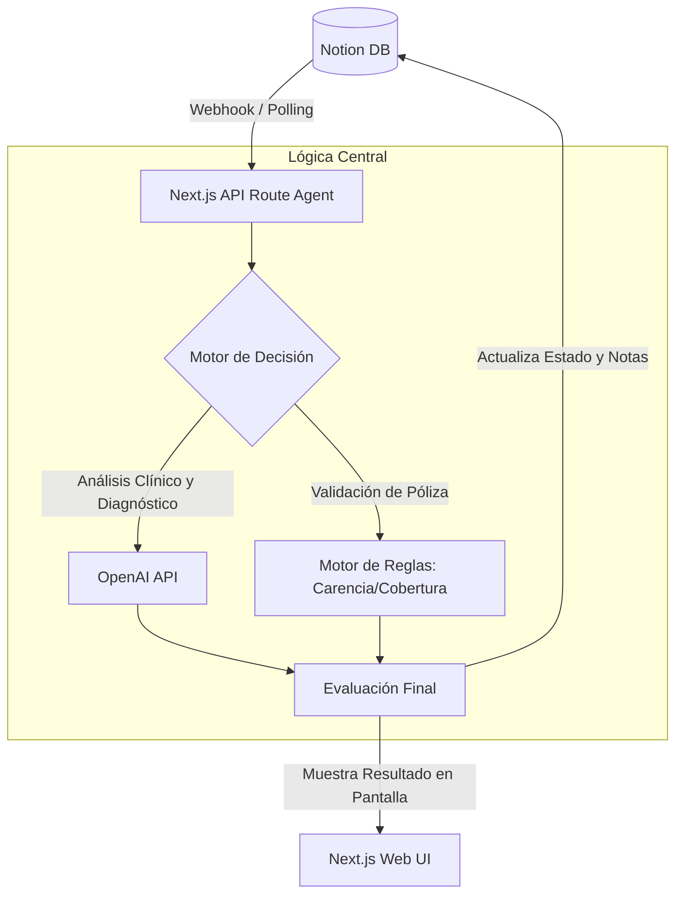

# 🏥 Agente de Pre-Autorización Quirúrgica en Tiempo Real

**"Aprobaciones médicas en segundos, no en días."**

Un agente inteligente diseñado para **automatizar y acelerar el proceso
de pre‑autorización de cirugías**, analizando informes médicos y pólizas
de seguro en tiempo real para emitir respuestas instantáneas.

Este proyecto fue desarrollado como **entregable técnico para el
registro al HackIAthon**.

------------------------------------------------------------------------

# 📋 Entregables HackIAthon

🚀 **Agente Funcional (Web UI):**\
\[Inserta aquí tu enlace a Vercel / Netlify\]

💻 **Repositorio de Código:**\
\[Inserta aquí el enlace de GitHub / GitLab\]

📚 **Notion Public Workspace (Opcional):**\
\[Inserta aquí el enlace a la base de datos de Notion\]

------------------------------------------------------------------------

# 🎯 El Problema

El proceso de autorización de cirugías en aseguradoras y hospitales
suele ser **lento, manual y propenso a errores**.

## Principales problemas

🧑‍⚕️ **Angustia del Paciente**\
Tiempos de espera de **horas o incluso días** para recibir una
autorización quirúrgica.

⚙️ **Cuellos de Botella Operativos**\
Revisión manual de:

-   Informes médicos
-   Diagnósticos clínicos
-   Coberturas de pólizas
-   Exclusiones
-   Periodos de carencia

📉 **Errores Humanos**\
La interpretación manual de reglas médicas y contractuales genera
errores que pueden afectar la atención del paciente.

💰 **Impacto en Costos** - Retrasos en atenciones urgentes - Aumento en
costos de auditoría médica - Ineficiencia operativa en aseguradoras

------------------------------------------------------------------------

# 💡 La Solución

Un **sistema automatizado basado en inteligencia artificial** que
realiza validación de reglas de negocio y análisis clínico avanzado en
segundos.

El agente distingue entre:

-   🚑 **Casos quirúrgicos urgentes** (emergencias o diagnósticos
    críticos)
-   📅 **Casos programados** (cirugías electivas)

Esto permite acelerar decisiones sin comprometer la seguridad médica.

------------------------------------------------------------------------

# ⚙️ Características Principales

✅ **Análisis Clínico con IA (NLP)**\
Extrae diagnósticos e indicaciones quirúrgicas desde informes médicos
utilizando modelos de lenguaje.

✅ **Normalización Médica** Convierte términos clínicos a estándares
como:

-   CIE‑10 (diagnósticos)
-   CPT / CUPS (procedimientos)

✅ **Validación Automática de Pólizas** El sistema evalúa:

-   Cobertura
-   Exclusiones
-   Periodos de carencia
-   Reglas del seguro

✅ **Respuesta en Tiempo Real** El agente puede emitir una decisión en
segundos:

-   Aprobado
-   Requiere revisión
-   Rechazado

✅ **Interfaz Web** Interfaz simple donde el usuario puede:

-   Subir informes médicos
-   Consultar estado de autorización
-   Recibir decisión automática

------------------------------------------------------------------------

## 🏗️ Arquitectura

### Vista General del Sistema



### Flujo simplificado:

1.  Usuario carga informe médico
2.  Sistema extrae información clínica con IA
3.  Diagnóstico y procedimiento se normalizan a estándares médicos
4.  Motor de reglas valida la póliza
5.  El agente genera la decisión de pre‑autorización

Tecnologías potenciales:

-   OpenAI API
-   Python / Node.js
-   NLP médico
-   Base de datos clínica
-   Web UI (React / Next.js)

------------------------------------------------------------------------

# 🚀 Cómo ejecutar el proyecto

``` bash
# Clonar repositorio
git clone https://github.com/tuusuario/tu-repo.git

# Entrar al proyecto
cd tu-repo

# Instalar dependencias
npm install

# Ejecutar servidor
npm run dev
```

------------------------------------------------------------------------

# 📊 Casos de Uso

🏥 **Hospitales** - Reducir tiempos de autorización

🛡 **Aseguradoras** - Automatizar auditorías médicas

👨‍⚕️ **Personal administrativo** - Reducir carga operativa

👨‍👩‍👧 **Pacientes** - Acceso más rápido a procedimientos médicos

------------------------------------------------------------------------

# 👨‍💻 Equipo

**La Pochita Stone**\
Proyecto desarrollado para **HackIAthon**.
